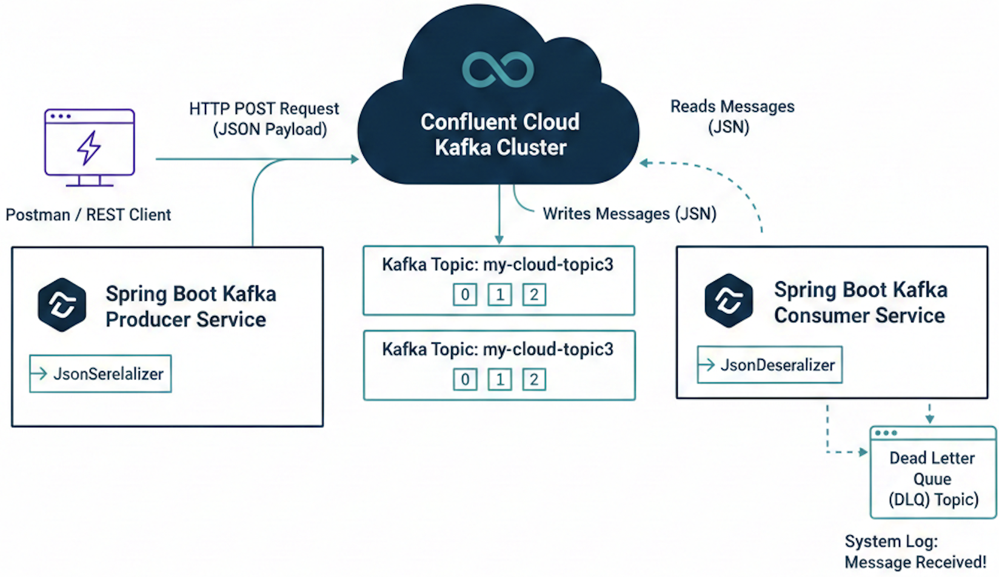

# Kafka Producer/Consumer Demo (Confluent Cloud) 🚀
A Spring Boot application demonstrating reliable, structured message passing between a REST Producer and a Kafka Consumer, using Confluent Cloud for message brokering.



This project was built to showcase solutions for common Spring Kafka and Jackson serialization issues.

---

## 🛠️ Prerequisites
* **Java 17+** (JDK)
* **Maven** (version 3.6.0+)
* **Confluent Cloud Account:** An active cluster and API Key/Secret are required for connection.

---

## ⚙️ Setup and Configuration

1.  **Clone the Repository:**
    ```bash
    git clone [https://github.com/siralfbaez/kafka-cc-demo-mvj.git](https://github.com/siralfbaez/kafka-cc-demo-mvj.git)
    cd kafka-cc-demo-mvj
    ```

2.  **Update Configuration:**
    Ensure your Kafka connection details are configured in your `application.properties` file. These values link your services to the Confluent Cloud cluster:
    * `spring.kafka.properties.sasl.jaas.config` = (Your full connection string)
    * `spring.kafka.properties.sasl.username` = (Your API Key)
    * `spring.kafka.properties.sasl.password` = (Your API Secret)

---

## ▶️ Running the Application

1.  **Build and Install Dependencies:**
    ```bash
    mvn clean install
    ```

2.  **Run the Spring Boot Application:**
    This command starts both the Producer and Consumer services simultaneously:
    ```bash
    mvn spring-boot:run
    ```

---

## 🧪 Testing the Message Flow

The Producer exposes a REST endpoint to accept the structured `CloudMessage` object.

* **Endpoint:** `POST` `http://localhost:8080/api/v1/kafka/publish`
* **Body Type:** `Raw` / `JSON (application/json)`

**Sample Payload (CloudMessage):**
This payload successfully tests the serialization of the `java.time.Instant` field.

```json
{
    "id": "MSG-001",
    "content": "A successful JSON message from Postman!",
    "timestamp": "2025-11-25T10:26:00Z"
}